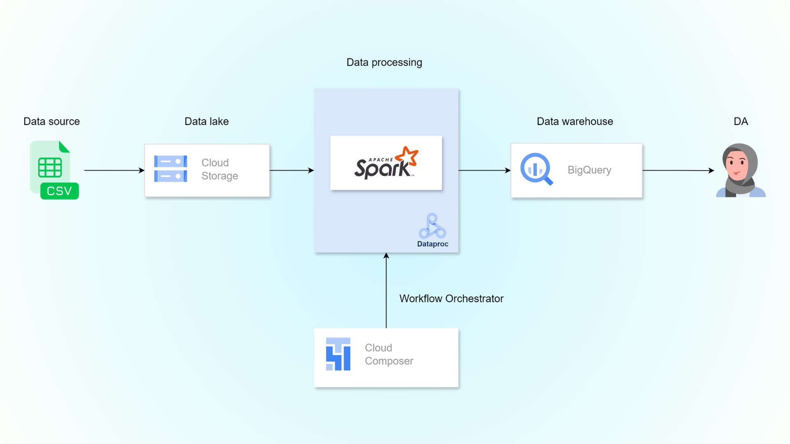

# ETL Pipeline บน Google Cloud Platform

โปรเจกต์นี้เป็นตัวอย่าง **ETL pipeline** โดยใช้ **PySpark** บน Google Cloud Platform (Dataproc) และโหลดข้อมูลที่ได้เข้า **BigQuery**  

## Flow การทำงานของโปรเจกต์นี้

- ใช้ **Spark** เพื่อ **Extract และ Transform ข้อมูล**
- เก็บข้อมูลที่ Cloud Storage(Data lake)
- โหลดข้อมูลที่พร้อมสำหรับการวิเคราะห์เข้าสู่ BigQuery(Data warehouse)
- จัดการ Workflow ทั้งหมดด้วย Cloud Composer (Apache Airflow)

## สิ่งที่ได้เรียนรู้จากโปรเจกต์นี้
- การใช้ PySpark บน Dataproc
- การจัดเก็บข้อมูลแบบ partitioned Parquet ทำให้ query เร็วขึ้น
- การทำความสะอาดและ standardize ข้อมูลด้วย Spark SQL functions
- การออกแบบ **ETL pipeline แบบ end-to-end**
- การ Setup โปรเจกต์ต้องคำนึงถึงค่าใช้จ่ายด้วย
- การจัดการสิทธิ์ (Service Accounts + Permissions)

## แนวทางการปรับปรุงเพิ่มเติม
- Error Handling & Data Quality
- Monitoring และ logging
